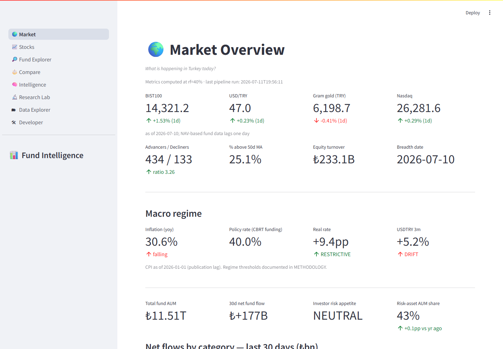
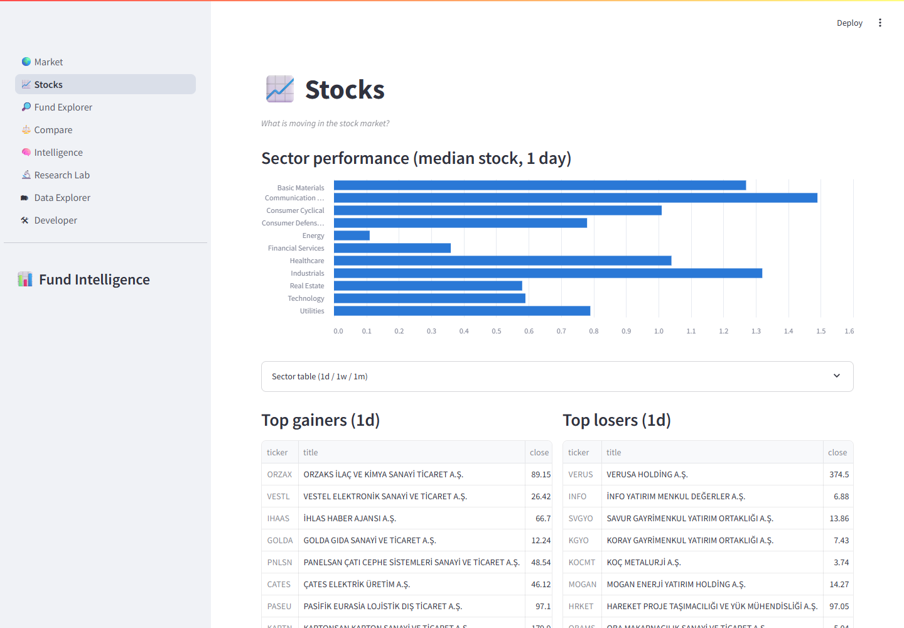
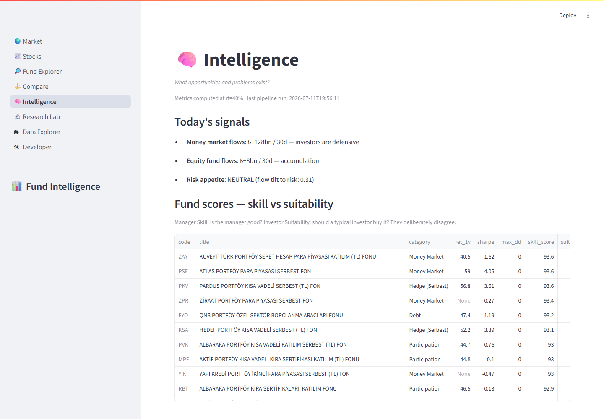

# Turkish Investment Intelligence Platform

An end-to-end research platform for the Turkish fund and equity
market, built on public data (TEFAS, KAP, TCMB EVDS, Yahoo).
Source: [github.com/amirremirr/turkish-investment-intelligence](https://github.com/amirremirr/turkish-investment-intelligence)

## What it does

- **Data**: 2,457 funds (mutual + pension), 1.3M daily NAV/AUM/investor
  rows, 4,500+ portfolio-allocation snapshots per day, 613 BIST stocks,
  macro series — refreshed nightly by a scheduled cloud pipeline.
- **Analytics**: 4-factor models with the NAV-lag correction, exact
  share-count fund flows, Manager Skill vs Investor Suitability
  scores, closet-index detection, macro regime engine.
- **Holdings**: monthly **stock-level fund holdings** parsed from KAP
  portfolio disclosures — crowding, peer active share, stock-level
  attribution.
- **Products**: an 8-page terminal (screenshot above), auto-generated
  monthly intelligence reports, rule-based investment memos.

## Research

Five reproducible studies — start here:
**[Research notes](research/)** · [Methodology](METHODOLOGY.html) ·
[Audit](AUDIT.html) · [SWOT](SWOT.html)

| Finding | Evidence |
|---|---|
| Retail equity-fund flows are mildly **contrarian** | NW t=−2.5 at 21d; calm markets only |
| Investors chase **quarterly** winners | 63-day trailing returns, NW t=4.3 |
| **52 closet index funds** among 236 large "active" equity funds | R²≥0.85, β≈1, α≤0 (excess-of-cash) |
| TEFAS **NAVs lag the market** (+1d/+2d) | index-fund β: 0.12 same-day → 0.995 lagged |
| The 2026 equity rally is **price effect, not conviction** | AUM share ↑ 5.4→9% with negative flows |

## Terminal

| | |
|---|---|
|  |  |

## Documentation

- [Architecture](ARCHITECTURE.html) — ETL warehouse design, operations
- [Methodology](METHODOLOGY.html) — every metric defined, with limitations
- [Institutional audit](AUDIT.html) — what was checked, found, fixed
- [KAP holdings pipeline](KAP_HOLDINGS.html) — status, upsides, limitations
- [Data dictionary](DATA_DICTIONARY.html)
- [Usage / CLI reference](USAGE.html)

*Not investment advice. Built for research and education.*
