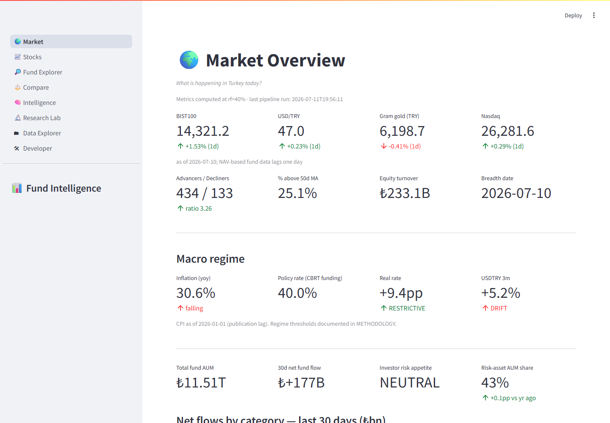
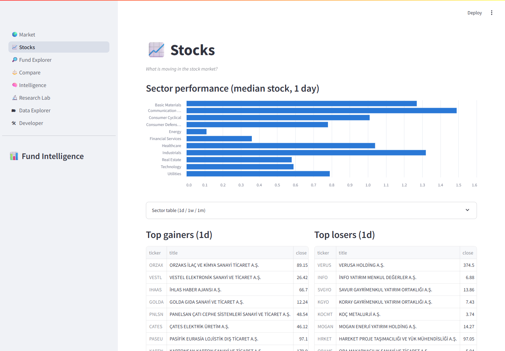
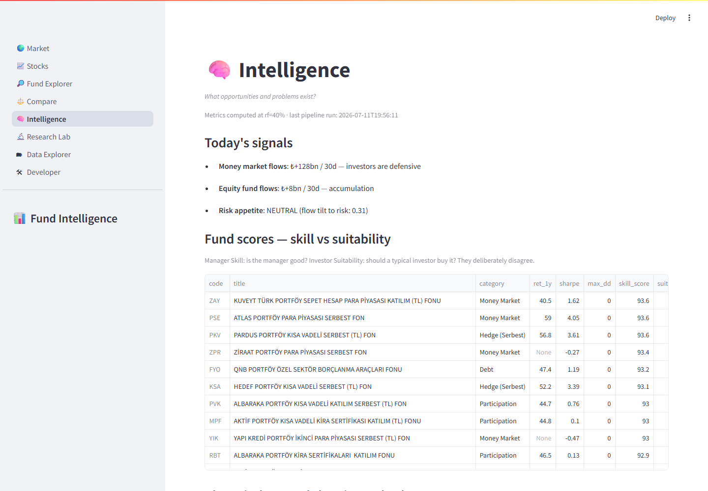

# Turkish Investment Intelligence Platform

An open, public-data research platform for Turkish funds and shares. It helps
you explore what the data says while making the limits visible. It is not
investment advice or a promise of future returns.

**New here? Start with the [plain-English guide](START_HERE.html) and the
[current research results](RESULTS.html).**

Source: [github.com/amirremirr/turkish-investment-intelligence](https://github.com/amirremirr/turkish-investment-intelligence)

## What it does

- **Funds**: daily NAV, size, investor-count and allocation data for the
  observed TEFAS universe.
- **Holdings**: monthly stock-level fund holdings parsed from available KAP
  portfolio reports; coverage is forward-built and not yet universal.
- **Shares**: daily BIST prices and delayed intraday monitoring, used for
  clearly labelled exploratory research.
- **Analytics**: factor exposures, fund flows, index-likeness comparisons,
  drawdowns and category-relative research scores.
- **Products**: a web app, an eight-page Streamlit terminal, reports and
  reproducible research notes.

## Research: the honest summary

The project does not turn a historical chart into a recommendation. Current
conclusions include:

| Finding | Status and evidence |
|---|---|
| TEFAS NAV timing needs a market-date lag | **Measured:** correcting the timing moved one liquid index-fund beta from about 0.12 to 0.995. |
| 52 index-like funds among 236 large active funds | **Descriptive:** a similarity measure, not a net-of-fee judgement. |
| Retail equity-fund flows look mildly contrarian | **Exploratory:** small effect in one regime; not tradeable or causal. |
| "Investors chase winners" | **Retired:** it failed the stronger fund-level test. |
| Daily stock-attention continuation | **Rejected for use:** the initial next-day result was negative; intraday evidence is now being collected prospectively. |

Read [the complete results register](RESULTS.html), then use the
[research notes](research/) and [methodology](METHODOLOGY.html) for the full
methods, assumptions and reproducibility commands.

## Terminal

| | |
|---|---|
|  |  |

## Documentation

- [Start here](START_HERE.html) - plain-English guide to the project, data and limits
- [Current research results](RESULTS.html) - what worked, failed or remains unproven
- [Methodology](METHODOLOGY.html) - definitions, assumptions, statistics and claim rules
- [Data policy](DATA_POLICY.html) - sources, coverage, legal posture and corrections
- [KAP holdings pipeline](KAP_HOLDINGS.html) - monthly holdings status, coverage and limitations
- [Research notes](research/) - detailed studies with reproduction commands
- [Architecture](ARCHITECTURE.html) - data pipeline and serving design
- [Monitoring](MONITORING.html) and [operations](OPERATIONS.html) - data-health controls and response process
- [Data dictionary](DATA_DICTIONARY.html) - every stored table and field
- [Usage and CLI reference](USAGE.html) - how to run the project locally

*Built for research and education. Not investment advice.*
