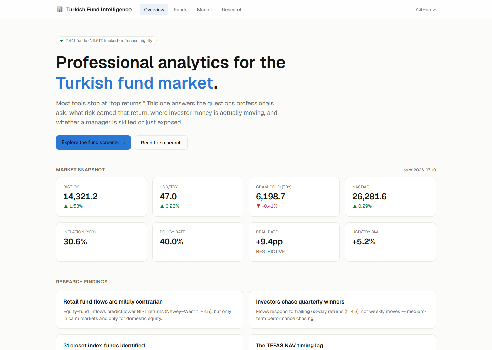

# Web — public-facing terminal (Next.js)

The polished public product for the Turkish Fund Intelligence platform.
A read-only Next.js 16 (App Router) site that reads the **Supabase
Postgres serving copy** produced by the Python pipeline
([../docs/SUPABASE.md](../docs/SUPABASE.md)).



## Architecture

```
Supabase Postgres (serving)  ──►  Server Components (lib/queries.ts)
                                   ──►  ISR-cached pages (revalidate 30m–1h)
```

- **All DB access is server-side** through a single layer
  ([lib/db.ts](lib/db.ts), postgres.js). Credentials never reach the
  browser. To add auth/realtime later, swap that one file for the
  Supabase JS client.
- **ISR**: pages cache and revalidate (`export const revalidate`); the
  60 largest funds are prerendered via `generateStaticParams`, the rest
  render on-demand and cache.
- **Zero client chart JS**: the NAV chart is a server-rendered SVG
  ([components/sparkline.tsx](components/sparkline.tsx)). The only client
  component is the interactive screener table.
- Light/dark theming via CSS variables; tabular figures; a brand-neutral
  blue accent.

## Pages

| Route | What |
|---|---|
| `/` | Landing: live market snapshot, macro regime, headline findings |
| `/funds` | Interactive screener — sort/filter/search 1,000+ scored funds |
| `/funds/[code]` | Fund profile: metrics, NAV chart, factor attribution, holdings |
| `/market` | Category flows, sector performance, crowding, risk appetite |
| `/research` | The five research notes |

## Local development

```bash
npm install
# .env.local must contain the Supabase serving connection string:
#   SUPABASE_DB_URL=postgresql://postgres.<ref>:<pw>@aws-0-<region>.pooler.supabase.com:5432/postgres
npm run dev      # http://localhost:3000
npm run build    # production build (prerenders from Supabase)
```

## Deploy (Vercel)

1. Import the repo in Vercel; set **Root Directory = `web`**.
2. Add the `SUPABASE_DB_URL` environment variable — use the Supabase
   **transaction pooler** (port **6543**), not the session pooler
   (5432). Serverless functions and the build open many short-lived
   connections; the session pooler caps clients at ~15 and the build
   exhausts it, while the transaction pooler multiplexes and is built
   for this. (The Python pipeline uses the 5432 session pooler; only
   the web app uses 6543.)
3. Deploy. ISR keeps pages fresh; the nightly Python pipeline refreshes
   the underlying Supabase data.

## Notes on data access

- Fund detail pages are **not prerendered at build** — they render on
  first request and cache via ISR (`revalidate`). Prerendering hundreds
  at build would open one pooler connection per fund and exhaust the
  cap. On-demand + cache is both robust and fast after the first hit.
- `lib/db.ts` uses a per-process pool of `max: 1` for the same reason.
